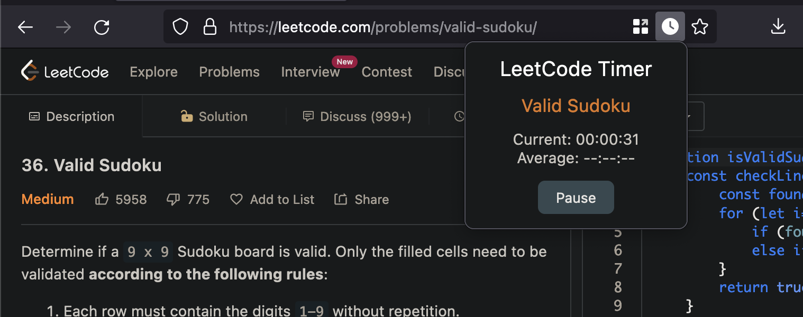

# LeetCode Timer

A small web extension that automatically starts to time your leetcode problems. It will also automatically stop the timer when you finish a problem, and compare your current time against your average.



## Flow

- Visiting ```*://*.leetcode.com/problems/*``` triggers the timer to begin
- Timer is loaded as a content script for the page
  - This allows different timers for different pages
- Opening the page action displays elapsed time from the content script

## Goal

- Timer function
  - Timer begins when problem is opened
  - Timer ends when problem is marked solved
- Log times per question and difficulty
- View and compare current vs average times per question/difficulty

## Todo

- Read page
  - Get problem difficulty
- Fix pause function
  - Currently displays time based on start time.
  - Gotta track how much time was spent paused and resume properly.
- Store times per question and difficulty
  - localstorage? indexdb?
- Color icon?
